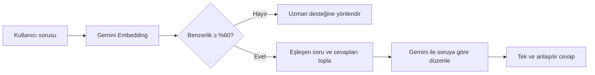
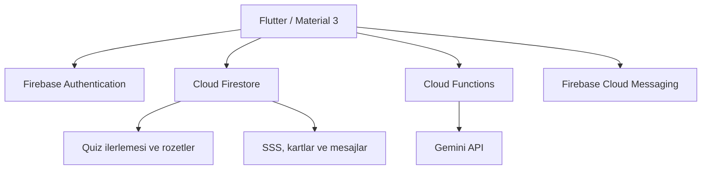

<div align="center">
  

  # TÜBİTAK Aile Destek ve Öğrenme Platformu

  **Anneler ile üst kuşağı bilgi, iletişim ve etkileşimli öğrenme etrafında buluşturan Flutter uygulaması.**

  <p>
    
    
    
    
    
  </p>
</div>

---

## Proje Hakkında

Bu proje; farklı kuşaklardaki kullanıcıların güvenli bir ortamda bilgiye erişmesini, uzmanlarla iletişim kurmasını ve oyunlaştırılmış kartlarla öğrenmesini amaçlayan bir mobil platformdur.

Uygulamada **Anne**, **Üst Kuşak** ve **Admin** olmak üzere üç farklı kullanıcı deneyimi bulunur. İçerikler Firebase üzerinden yönetilir; chatbot, veri tabanındaki doğrulanmış cevapları Gemini yardımıyla kullanıcının sorusuna uygun biçimde düzenler.

<div align="center">
  
  <br />
  <sub>Rol seçimi ve hareketli pastel arka plana sahip giriş ekranı</sub>
</div>

## Öne Çıkan Özellikler

| Alan | Özellikler |
|---|---|
| 👥 **Rol tabanlı kullanım** | Anne, Üst Kuşak ve Admin için ayrı ekranlar ve yönlendirmeler |
| 🧠 **Öğrenme kartları** | A/B/C/D seçenekli sorular, rastgele oluşturulan çeldiriciler ve anlık cevap geri bildirimi |
| 🔁 **Yanlışları tekrar çözme** | Yanlış cevaplanan kartların kullanıcıya özel kaydı ve daha sonra yeniden sorulması |
| 🏅 **Rozet sistemi** | Başarı oranına göre %25, %50, %75 ve %100 Bilgi Ustası rozetleri |
| 🤖 **Akıllı chatbot** | Semantik eşleşme, doğrulanmış cevapların Gemini ile kullanıcı sorusuna göre düzenlenmesi |
| 💬 **Mesajlaşma** | Kullanıcı ve yönetici arasında soru-cevap akışı |
| 🔔 **Bildirimler** | Firebase Cloud Messaging ve cihaz içi bildirim desteği |
| ❓ **SSS** | Kullanıcıların hızlıca erişebildiği soru-cevap içerikleri |
| 🛠️ **Yönetim paneli** | Kullanıcı, içerik, chatbot, bildirim ve oyun kartı yönetimi |
| ✨ **Canlı arayüz** | Sayfa geçişleri, 3B kart çevirme, kademeli girişler ve hareketli pastel arka plan |

## Öğrenme Deneyimi

Oyun kartlarının her biri veri tabanındaki bir soru-cevap kaydından oluşur. Kart açıldığında doğru cevap ile diğer kartlardan seçilen üç farklı cevap karıştırılarak dört seçenek sunulur. Böylece ayrıca yanlış cevap verisi tutmaya gerek kalmaz.

```text
Kartın sorusu
      │
      ▼
Doğru cevap + diğer kartlardan 3 cevap
      │
      ▼
     A / B / C / D
      │
      ├── Doğru → ilerleme güncellenir, yanlış kaydı temizlenir
      └── Yanlış → wrongCards koleksiyonuna eklenir
```

Kullanıcı oyun kartlarına girdiğinde iki mod arasından seçim yapabilir:

1. **Normal Sorular:** Kullanıcıya tanımlanmış kartlarla standart çalışma.
2. **Yanlış Sorular:** Daha önce yanlış cevaplanan kartları yeniden çözme.

## Rozetler ve İlerleme

Kullanıcının doğru cevap sayısı, kendisine tanımlanmış toplam soru sayısına göre hesaplanır. Ulaşılan eşikler kullanıcı profilinde saklanır ve son kazanılan rozet ana ekranda gösterilir.

| Başarı | Rozet |
|:---:|---|
| %25 | 🥉 %25 Bilgi Ustası |
| %50 | 🥈 %50 Bilgi Ustası |
| %75 | 🥇 %75 Bilgi Ustası |
| %100 | 🏆 %100 Bilgi Ustası |

## Chatbot Nasıl Çalışır?

Chatbot, kullanıcının sorusunu doğrudan serbest biçimde cevaplamak yerine doğrulanmış veri tabanı kayıtlarını temel alır:



- Kullanıcının asıl sorusu Gemini'ye gönderilir.
- Bir veya birden fazla eşleşen soru-cevap kaydı bağlam olarak eklenir.
- Gemini yalnızca eşleşen cevapları düzenler ve birleştirir; yeni bilgi üretmesi istenmez.
- Yapay zekâ servisi geçici olarak cevap veremezse en iyi veri tabanı cevabı yedek olarak kullanılır.

## Teknik Mimari



### Kullanılan Teknolojiler

- **Flutter & Dart:** Mobil kullanıcı arayüzü
- **Material 3:** Tema ve bileşen sistemi
- **Firebase Authentication:** Kullanıcı kimlik doğrulama
- **Cloud Firestore:** Kullanıcı, içerik, ilerleme ve mesaj verileri
- **Cloud Functions for Firebase:** Güvenli sunucu tarafı işlemleri
- **Firebase Cloud Messaging:** Anlık bildirimler
- **Flutter Local Notifications:** Uygulama içi cihaz bildirimleri
- **Gemini Embeddings & Gemini 2.5 Flash:** Semantik eşleştirme ve cevap düzenleme
- **Shared Preferences:** Cihaz üzerinde küçük yerel tercihler

## Proje Yapısı

```text
tubitak/
├── android/                  # Android yapılandırması
├── assets/                   # Logo ve uygulama görselleri
├── docs/screenshots/         # README ekran görüntüleri
├── functions/                # Firebase Cloud Functions ve Gemini akışı
├── lib/
│   ├── Pages/                # Kullanıcı ve yönetim ekranları
│   ├── services/             # Bildirim, FCM ve quiz ilerleme servisleri
│   ├── widgets/              # Ortak animasyon ve rozet bileşenleri
│   ├── firebase_options.dart # FlutterFire yapılandırması
│   └── main.dart             # Uygulama başlangıç noktası
├── test/                     # Flutter testleri
├── yapılanlar/               # Geliştirme notları
├── firebase.json             # Firebase proje yapılandırması
└── pubspec.yaml              # Flutter bağımlılıkları ve varlıklar
```

## Kurulum

### Gereksinimler

- Flutter SDK — proje Dart SDK `^3.10.3` ile yapılandırılmıştır
- Android Studio veya Android SDK
- Java Development Kit
- Node.js `24` — Cloud Functions için
- Firebase CLI
- Firebase projesine erişim

### 1. Projeyi hazırlayın

```bash
git clone <proje-deposu-adresi>
cd tubitak
flutter pub get
```

### 2. Firebase yapılandırmasını ekleyin

Projeyi kendi Firebase ortamınızda kullanacaksanız FlutterFire CLI ile yapılandırmayı yeniden üretin:

```bash
dart pub global activate flutterfire_cli
flutterfire configure
```

Android için oluşan `google-services.json` dosyasının aşağıdaki konumda bulunduğunu kontrol edin:

```text
android/app/google-services.json
```

> [!IMPORTANT]
> Gemini anahtarı, servis hesabı bilgileri ve diğer gizli değerler kaynak koda veya Git geçmişine eklenmemelidir. Bunları Firebase Secret Manager ya da güvenli ortam değişkenleriyle yönetin.

### 3. Cloud Functions bağımlılıklarını kurun

```bash
cd functions
npm install
cd ..
```

### 4. Cihazı seçip uygulamayı çalıştırın

Bağlı cihaz ve emülatörleri listeleyin:

```bash
flutter devices
```

Seçtiğiniz cihaz kimliğiyle uygulamayı başlatın:

```bash
flutter run -d <cihaz-kimliği>
```

Örnek:

```bash
flutter run -d emulator-5554
```

## Test ve Derleme

Kod analizi:

```bash
flutter analyze
```

Testler:

```bash
flutter test
```

Android debug APK:

```bash
flutter build apk --debug
```

Oluşturulan APK:

```text
build/app/outputs/flutter-apk/app-debug.apk
```

## Cloud Functions

Fonksiyonları yerel emülatörde çalıştırmak için:

```bash
cd functions
npm run serve
```

Yetkiniz olan Firebase projesine dağıtmak için:

```bash
cd functions
npm run deploy
```

> [!NOTE]
> Dağıtım komutu canlı Firebase ortamını değiştirir. Çalıştırmadan önce doğru projede olduğunuzu `firebase use` ile doğrulayın.

## Animasyon ve Erişilebilirlik

- Sayfalar arasında yumuşak kayma ve saydamlık geçişleri bulunur.
- Oyun kartları ön ve arka yüz arasında 3B olarak döner.
- İçerikler kademeli biçimde ekrana gelir.
- Pastel ışıklar ve parçacıklar arka planda yavaşça hareket eder.
- Logo ve kalp görsellerinde hafif süzülme efekti kullanılır.
- Hareketli katmanlar dokunma olaylarını engellemez.
- Cihazın **animasyonları azalt/devre dışı bırak** tercihi desteklenir.

## Geliştirme Notları

Projede tamamlanan çalışmaların ayrıntılı kaydı için [yapılan tüm düzenlemeler](yapılanlar/yapilan_tum_duzenlemeler.md) belgesine bakabilirsiniz.

## Katkı Akışı

1. Yeni bir dal oluşturun: `git switch -c ozellik/yeni-ozellik`
2. Değişikliklerinizi küçük ve anlaşılır commit'lerle kaydedin.
3. `flutter analyze` ve `flutter test` komutlarını çalıştırın.
4. Değişikliğin amacını ve test sonucunu açıklayan bir pull request açın.

---

<div align="center">
  <strong>Bilgiyi paylaşan, kuşakları yakınlaştıran bir deneyim.</strong>
  <br /><br />
  Flutter 💙 ve Firebase 🔥 ile geliştirildi.
</div>

